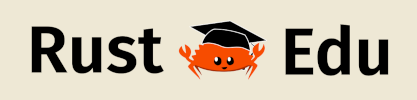

# Teach-rs

Teach-rs is a university course for computer science students, introducing the Rust Programming Language, and is available for anyone who wants to teach Rust.

Why? Have a look at our [blog post](https://tweedegolf.nl/en/blog/127/want-more-rust-break-the-cycle) introducing the course.

This repo will contain everything that's needed to organize the course: slides, exercises, tools, setup instructions and more.

*While all the available material is user-ready, this repo is not yet as exhaustive as we'd like, so feedback and [contributions](./CONTRIBUTING.md) are welcome! So is sponsorship; read more below or on our [Sponsorship page](https://github.com/sponsors/trifectatechfoundation).*

## Usage
The teacher's guide can be found [here](./teachers_guide.md).
Have a look at the [ModMod Readme](./modmod/README.md) for instructions on how to render the content of a track.

## Structure
The actual content can be found in the [`content`](./content) directory.
The content is structured in a tree of Tracks, Modules, Units, and Topics.
Tracks define a single course, which consists of one or more Modules, which again combines one or more Units, which again is a set of Topics.
Units roughly correspond to one lecture+tutorial (or at least that is the idea, but TODO), and consist of several Topics. Related Units are combined in a Module.
Topics are packages that cover a single topic, and include a small number of slides, some exercises, and an exercise descripion.
Topics can define their learning objectives, further reading material, and how they should be summarized in a Unit introduction.

Tracks, Modules, Units, and Topics and the files they refer to are described in the several TOML files in the [`content`](./content) directory.
[ModMod](./modmod/README.md) combines the content into a structure that can be directly published to your students in a Git repo, for instance.

## Pre-defined tracks
- [Rust Language Introduction](./content/rust-intro.track.toml) aims to introduce the basics to the Rust programming language, and to enable students to engineer their own applications and crates.
- [Rust for the Web](./content/rust-for-web.track.toml) covers content that is needed to use Rust in web applications.
- [Rust for Systems Programming](./content/rust-for-systems.track.toml) contains more low-level topics, to teach systems programming using Rust.
- [Scientific Rust](./content/scientific-rust.track.toml) is about using Rust in scientific programming.
- [Full](./content/full.track.toml) contains all available teach-rs content.

*Note: although the outline of the tracks is mostly complete, the tracks may still contain TODOs. You're invited to contribute your own content to fix these!*

## High-level goals
Teach-rs aims to provide an open-source course, lectures, tutorials and exercises, that can be used by any higher education institution.
Use one of the pre-defined tracks, or compose your own with the content we provide and your own.

1. Provide a modular, resuable basis for live-taught Rust courses
2. Provide students with practical, hands-on experience
3. Provide students with background information of Rust features
4. Provide students with ability to judge whether Rust fits a project
5. Provide several specialized learning tracks that focus on different applications (e.g. systems, embedded, web)
6. Enable teachers to contribute their material for others to use

## Contributing
If you'd like to improve teach-rs, either by doing touchups, restructuring a module, or even adding a module, please refer to the [contributing guidelines](./CONTRIBUTING.md) before you get started.

## About the project

The project was created by [Tweede golf](https://tweedegolf.nl), and has since moved to the [Trifecta Tech Foundation](https://trifectatech.org).

### Our sponsors

#### Founding sponsors

The project's initial sponsor is the Faculty of Informatics and Information Technologies (FIIT) of the Slovak University of Technology (STU) in Bratislava, Slovakia. [FIIT](https://www.fiit.stuba.sk/en.html?page_id=749)'s contribution has enabled us to lay the groundwork for the course. [Tweede golf](https://tweedegolf.nl/en) and [Rust Edu](https://rust-edu.org/) have also contributed substantially to the creation of teach-rs.

In addition, one of our maintainers, [@hdoordt](https://github.com/hdoordt), received a grant from the [Rust Foundation](https://foundation.rust-lang.org/).

#### Silver sponsors

And a big thank you to our Silver sponsors:

- [Gofore](https://gofore.com/en/)
- [RustJobs.dev](https://rustjobs.dev/)

### Support teach-rs

Contact us if you´re interested in financially supporting the maintenance and further development of the teach-rs resources. See [trifectatech.org/support](https://trifectatech.org/support/).
You can also sponsor our work through [GitHub sponsors](https://github.com/sponsors/trifectatechfoundation).
