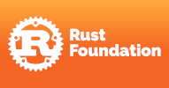

# Rust 101

Rust 101 is a university course for computer science students, introducing the Rust Programming Language, and is available for anyone who wants to teach Rust.

Why? Have a look at our [blog post](https://tweedegolf.nl/en/blog/80/rust-101-open-source-university-course) introducing the course.

This repo will contain everything that's needed to organize the course: slides, exercises, tools, setup instructions and more.

The rendered exercises, including installation instructions, can be found at <https://101-rs.tweede.golf>

*Currently highly in flux, and incomplete, but feedback is welcome! So is sponsorship; read more below or on our [Sponsorship page](https://github.com/sponsors/tweedegolf).*

## High-level goals

1. Deep dive, intermediate level Rust skill
2. Know the problems Rust aims to solve
3. Get practical, hands-on experience
4. Know why Rust features are the way they are
5. Ability to write custom CLI/server applications using popular crates or to contribute to existing projects
6. Ability to judge whether Rust fits project requirements
7. Ability to teach Rust to other people

## Suggested course schedule

The course is setup so that, after modules A1-A3, cherry-picking the modules that suit your purpose is possible.

When used in full 12-week format, the schedule is:

| Week | Module       | Topic                                    |
| ---- | ------------ | ---------------------------------------- |
| 1    | 0,  A1  | Course intro  Language basics |
| 2    | A2           | Advanced Syntax, Ownership, references   |
| 3    | A3           | Traits and generics                      |
| 4    | B            | Application programming                  |
| 5    | C            | Multitasking                             |
| 6    | D            | Idiomatic Rust patterns                  |
| 7    | E            | Rust for web                             |
| 8    | F            | Safe Unsafe Rust                         |
| 9    | G            | FFI and Dynamic modules                  |
| 10   | P            | Final project                            |
| 11   | P            | Final project                            |
| 12   | P            | Final project presentation               |

The course assumes intermediate C/C++ knowledge.

The course outline, along with more elaborate learning objectives, can be found [here](./COURSE.md).
You can find instructions on the installation of used tools [here](./exercises/book/0-install/mod.md).

## About the project

Rust 101 aims to provide an open-source course, lectures, tutorials and exercises, that can be used by any higher education institution. In its entirety or by using bits and pieces to create your custom course.

The project is executed by Henk Oordt and others at [Tweede golf](https://tweedegolf.nl). It is a not-for-profit project, where the only requirement is that the cost of our work is covered.

### Other contributors

We're very happy with support in developing the course material from:

- Bernard van Gastel, Radboud University
- Florian Gilcher, Ferrous Systems
- Jonathan Donszelmann, TU Delft

### Our sponsors

#### Founding sponsors

The initial sponsor of the project is the Faculty of Informatics and Information Technologies (FIIT) of the Slovak University of Technology (STU) in Bratislava, Slovakia. [FIIT](https://www.fiit.stuba.sk/en.html?page_id=749)'s contribution has enabled us to layout the groundwork for the course.

In addition, lead developer Henk has received a grant from the [Rust Foundation](https://foundation.rust-lang.org/).

#### Silver sponsors

And a big thank you to our Silver sponsors:

- [Gofore](https://gofore.com/en/)
- [RustJobs.dev](https://rustjobs.dev/)

### Support Rust 101

We are in search of further funding for this project. Contact us if you´re interested, or [sponsor](https://github.com/sponsors/tweedegolf) our work. At the moment, any one-time or montly donation would support the maintenance of the project. Larger donations would enable us to create new modules and improve existing course material. 

