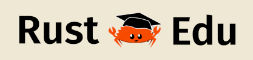
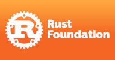

# Teach-rs

Teach-rs is material for building a university course for computer science students, introducing the Rust Programming Language, and is available for anyone who wants to teach Rust.

Why? Have a look at our [blog post](https://tweedegolf.nl/en/blog/127/want-more-rust-break-the-cycle) introducing the course.

This repo will contain everything that's needed to organize the course: slides, exercises, tools, setup instructions and more.

*While all the available material is user-ready, this repo is not yet as exhaustive as we'd like, so feedback and [contributions](./CONTRIBUTING.md) are welcome!*

## Intent

Teach-rs is meant to be a collection of teaching material about the Rust programming language for use in higher
education (whether that be universities focused on theoretical science, educational institutes of applied science, or
higher vocational education).
More broadly, it is intended to be also useful in any form of formal or informal classroom
education (e.g., community colleges).

It is not a *course in rust*, but rather meant to be used by teachers to *create* a course in Rust tailored to the needs
of their students.
Hence, the name: **teach-rs**.
That means that we expect (and encourage) every course that is taught
using teach-rs to make different selections of material.

The goal of this project is therefore for teach-r to consist of:

- Exercise material: exercise instructions and templates.
- A reference slide deck for use in lectures.
- Tools to help teachers easily make selections of material that make sure that essential parts are not skipped.

What is not in scope of teach-rs:

- The equivalent of a "book", i.e., reading material; good external resources exist both online and in book form.
  We do want to have a section on collecting all of those.
- Being usable as self-teaching aid. That is not to say that the material contained in this repository cannot be used
  to become self-taught in Rust, but that is not the primary mission.
- Solutions to exercises. Some of our exercises are open-ended and have multiple correct solutions. In line with being
  meant for use in higher education, students should reflect on their solutions themselves, discuss their work with
  their peers or receive feedback from their teacher/teaching assistants. The Rust compiler itself also lends itself
  well as a teaching aid: it will catch many mistakes and suggest improvements; i.e., various exercises may try to steer
  students into interaction with Rust compiler messages.

The material is free for any purpose (licensed under CC-BY-SA). It is highly appreciated that changes/improvements are
contributed back to us, even if the license doesn't necessarily demand it.

## Usage
The teacher's guide can be found [here](./book/teachers_guide.md).

## Structure
The actual content can be found in the [`book`](./book) and [`slides`](./slides) directories. The content is structured in several modules,
which each consists of one or more units.

## High-level goals
Teach-rs aims to provide an open-source course, lectures, tutorials and exercises, that can be used by any higher education institution.
Use one of the pre-defined tracks, or compose your own with the content we provide and your own.

1. Provide a modular, resuable basis for live-taught Rust courses
2. Provide students with practical, hands-on experience
3. Provide students with background information of Rust features
4. Provide students with ability to judge whether Rust fits a project
5. Provide several specialized learning tracks that focus on different applications (e.g. systems, embedded, web)
6. Enable teachers to contribute their material for others to use

## Contributing
If you'd like to improve teach-rs, either by doing touchups, restructuring a module, or even adding a module, please refer to the [contributing guidelines](./CONTRIBUTING.md) before you get started.

## About the project

The project was created by [Tweede golf](https://tweedegolf.nl), and has since moved to the [Trifecta Tech Foundation](https://trifectatech.org).

### Acknowledgements

#### Founding sponsors

The project's initial sponsor is the Faculty of Informatics and Information Technologies (FIIT) of the Slovak University of Technology (STU) in Bratislava, Slovakia. [FIIT](https://www.fiit.stuba.sk/en.html?page_id=749)'s contribution has enabled us to lay the groundwork for the course. [Tweede golf](https://tweedegolf.nl/en) and [Rust Edu](https://rust-edu.org/) have also contributed substantially to the creation of teach-rs.

In addition, the initial maintainer of teach-rs, [@hdoordt](https://github.com/hdoordt), received a grant from the [Rust Foundation](https://foundation.rust-lang.org/).

#### Silver sponsors

And a big thank you to our Silver sponsors:

- [Gofore](https://gofore.com/en/)
- [RustJobs.dev](https://rustjobs.dev/)

#### Thanks

Teach-rs grew out of internal course material used at Tweede Golf. It became much more than that, which is in no small part due to the motivation by and time invested by [@hdoordt](https://github.com/hdoordt).

We thank the former students of Slovak University of Technology (STU) in Bratislava who took part in our trial run of this course material in 2023.

### Support the Trifecta Tech Foundation

Contact us if you´re interested in financially supporting the maintenance and further development of the teach-rs resources. See [trifectatech.org/support](https://trifectatech.org/support/).
You can also sponsor our work through [GitHub sponsors](https://github.com/sponsors/trifectatechfoundation).
