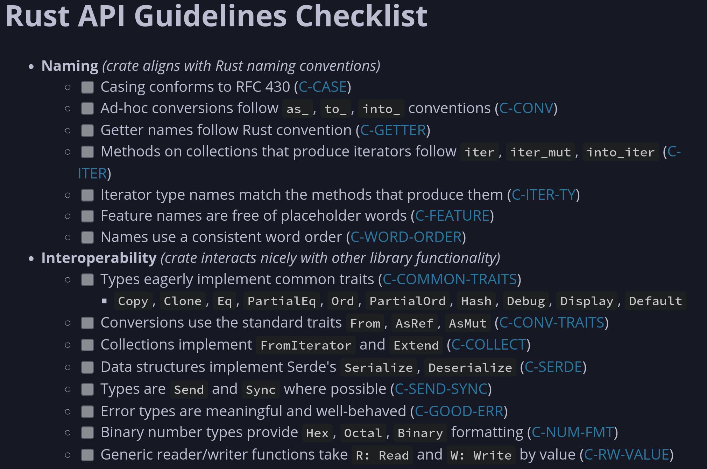
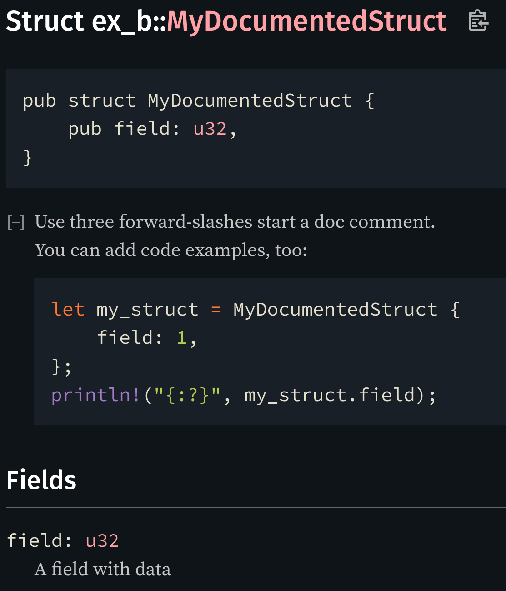

# Rust programming
Module B: Application programming
<!-- Start with welcome, students entering -->
<!-- TODO add subject code -->

---
layout: three-slots
---

## Who am i?
::left::
- Ferris
- I Love Rust

::right::


<!--
Optionally quickly introduce yourself, add photo
-->

---
layout: default
---
# Last time...
- Ownership model
- Move semantics
<!-- Recap on content from last time that current subject builds on -->

---
layout: section
---
# Quick questions

Any questions on last time's subject?
<!-- Keep it short. Any longer explanations can be deferred to tutorial -->

---
layout: section
---
# Recap Quiz

## [Link to quiz here]

---
layout: iframe
url: http://your-quiz-url-here
---
<!-- insert URL to quiz roundup in slide option `url` -->

---
layout: default
---

# In this module

Learn how to use Rust for writing high quality bigger applications

<!--
Introduce today's subject
-->

---
layout: default
---

# Learning objectives
<!-- List this module's learning objectives -->
- Set up your own Rust application and library
- Divide your code into logical parts with modules
- Create a nice API
- Test and benchmark your code
- Use common crates (tutorial)
- Improve compile time (tutorial)


---
layout: section
---
# Mindmap

What do you know already about this subject?

## [Mindmap access code here]
<!-- Quick mindmap, show mindmap access code -->

---
layout: iframe
url: http://your-interactive-mindmap-url-here
---
<!-- insert URL to live mindmap in slide option `url` -->

---
layout: cover
---
#  Module B
Application programming
<!-- Start lecture content here -->

---
layout: default
---

# Content overview
- Project structure
- API guidelines
- Testing and benchmarking
<!-- Give an overview of the subjects covered in this lecture -->


---
layout: section
---
# Rust Project structure

---
layout: default
---

# Terminology

- **Namespace:** Space a Rust item is defined in
- **Crate:** A package containin Rust source code. Library or binary.
- **Module:** Logical part of crate, public or private visibility
- **Workspace:** Set of related crates

---
layout: default
---

# Setting up a crate

Setting up a new crate is easy:

```bash {all|1-2|3-7}
$ cd /path/to/your/projects
$ cargo new my-first-app --bin
$ tree my-first-app
.
├── Cargo.toml
└── src
    └── main.rs
```

*Pass `--lib` instead of `--bin` to create a library*


---
layout: default
---
# Adding a dependency

To add a dependency from crates.io:
```bash {all|1|3-13|11-13}
$ cargo add tracing tracing-subscriber
[...]
$ cat Cargo.toml
[package]
name = "my-first-app"
version = "0.1.0"
edition = "2021"

# -snip-

[dependencies]
tracing = "0.1.37"
tracing-subscriber = "0.3.16"
```

---
layout: default
---

# Using dependencies

Dependencies from Cargo.toml can be:
  - imported with a `use`
  - qualified directly using namespace separator `::`

```rust {all|3-4,16-17|7-10}
// Import an item from this crate, called `my_first_app`
use my_first_app::add;
// Import an item from the `tracing` dependency
use tracing::info;

fn main() {
    // Use qualified path
    tracing_subscriber::fmt()
        .with_max_level(tracing::Level::DEBUG)
        .init();

    let x = 4;
    let y = 6;

    // Use imported items
    let z = add(x, y);
    info!("Let me just add {x} and {y}: {z}")
}

```


---
layout: default
---

# Other dependency sources

- Local
- Git

```bash {all|4|5}
$ cat Cargo.toml
# -snip-
[dependencies]
my_local_dependency = { path = "../path/to/my_local_dependency" }
my_git_dependency = { git = "<Git SSH or HTTPS url>", rev="<commit hash or tag>", branch = "<branch>" }
```

---
layout: default
---

# Modules

- Logical part of a crate
- Collection of items:
  - functions
  - structs
  - `impl` blocks
  - other modules
- Specific visibility
- Defined in blocks or files

*Mod structure `!=` file structure*


---
layout: default
---
# Module block
```rust {all|1-3,20|4-6,13|8-12|15-19}
// Public module
// Accessible from outside
pub mod my_mod {
    // Private module
    // Only accessible from parent module
    mod private_mod {

        // Public struct
        // Accessible wherever `private_mod` is
        pub struct PubStruct {
            field: u32,
        }
    }

    // Private struct
    // Only accessible from current and child modules
    struct PrivStruct {
        public: private_mod::PubStruct,
    }
}
```

---
layout: default
---

# Module files

Content specified in
- Either `some_mod.rs`
- Or `another_mod/mod.rs`

```bash {all|7|3-4}
$ tree src
.
├── another_mod
│   └── mod.rs
├── lib.rs
├── main.rs
└── some_mod.rs
```


---
layout: default
---

# Module files

Mod structure defined in other modules:

**lib.rs**
```rust {all|1-2|3-4|5-6}
// Points to ./some_mod.rs
mod some_mod;
// Points to ./another_mod/mod.rs
mod another_mod;
// Imports an item defined in ./another_mod/mod.rs
use another_mod::Item;
```

---
layout: default
---

# Module files vs blocks

- Use blocks for small (private) modules
- Use files for larger (public) modules
- Group related module files in folder

*If your file gets unwieldy, move code to new module file*

---
layout: default
---
# Multiple binaries & examples

- Binary entries: to `./src/bin/`
- Examples: `./examples/`

*Add entry to Cargo.toml for each example*

```bash {all|6,9-10|4-5}
$ tree
.
├── Cargo.toml
├── examples
│   └── my_example.rs
└── src
    ├── another_mod
    │   └── mod.rs
    ├── bin
    │   └── my_app.rs
    ├── lib.rs
    ├── main.rs
    └── some_mod.rs
$ cat Cargo.toml
# -snip-
[[example]]
name = "do_stuff"
```

---
layout: default
---

# Binaries vs examples

- Use multiple binaries if you are creating
  - multiple similar executables 
  - with the same dependencies
- Create examples to show users how to use your library

*Define a lib.rs as root module to organize shared code*


---
layout: default
---
# Workspaces
Bundle crates together
- Further organize code
- Allow less dependencies for uses

```bash
$ cat Cargo.toml
[workspace]
# Provide paths to directory the crates
# Cargo.toml files reside in
members = [
    "path/to/my_first_app",
    "path/to/my_second_app",
]
```

---
layout: section
---
# Creating a nice API

---
layout: two-cols
---

# Rust API guidelines

- Defined by Rust project
- [Checklist](https://rust-lang.github.io/api-guidelines/checklist.html)

**Read the checklist, use in final project and exercises!**

::right::


---
layout: default
---

# General recommendations

Make your API
- Unsurprising
- Flexible
- Obvious

**Next: Some low-hanging fruits**

---
layout: section
---
Make your API
# Unsurprising

---
layout: default
---

# Casing conventions
From [API guidelines](https://rust-lang.github.io/api-guidelines/naming.html#c-case):
| **Item**                                             | **Convention**                                                 |
| ---------------------------------------------------- | -------------------------------------------------------------- |
| Modules, Functions, Methods, Macros, Local variables | `snake_case`                                                   |
| Types, Traits, Enum variants                         | `UpperCamelCase`                                               |
| Statics, Constants                                   | `SCREAMING_SNAKE_CASE`                                         |
| Type parameters                                      | concise `UpperCamelCase`, usually single uppercase letter: `T` |
| Lifetimes                                            | short lowercase, usually a single letter: `'a`, `'de`, `'src`  |

---
layout: two-cols
---

# Implement/derive common traits


*As long as it makes sense* public types shoud implement:

- `Copy`
- `Clone`
- `Eq`
- `PartialEq`
- `Ord`
- `PartialOrd`

::right::

<div style="margin-top: 150px"></div>

- `Hash`
- `Debug`
- `Display`
- `Default`
- `serde::Serialize`
- `serde::Deserialize`


---
layout: section
---
Make your API
# Flexible

---
layout: default
---

# Use generics

```rust {all|1-3|5-9}
pub fn add(x: u32, y: u32) -> u32 {
    x + y
}

/// Adds two values that implement the `Add` trait,
/// returning the specified output
pub fn add_generic<O, T: std::ops::Add<Output = O>>(x: T, y: T) -> O {
    x + y
}
```

---
layout: default
---

# Accept borrowed data if possible

- User decides data storage location (heap vs. stack)
- Avoids unecessary moves
- Exception: non-big array `Copy` types

```rust {all|6-9|11-14}
/// Some very large struct
pub struct LargeStruct {
    data: [u8; 4096],
}

/// Takes owned [LargeStruct] and returns it when done
pub fn manipulate_large_struct(mut large: LargeStruct) -> LargeStruct {
    todo!()
}

/// Just borrows [LargeStruct]
pub fn manipulate_large_struct_borrowed(large: &mut LargeStruct) {
    todo!()
}
```

---
layout: section
---
Make your API
# Obvious

---
layout: two-cols
---

# Write Rustdoc

- Use 3 forward-slashes to start a doc comment
- You can add code examples, too

```rust
/// A well-documented struct.
/// ```rust
/// # // lines starting with a `#` are hidden
/// # use ex_b::MyDocumentedStruct;
/// let my_struct = MyDocumentedStruct {
///     field: 1,
/// };
/// println!("{:?}", my_struct.field);
/// ```
pub struct MyDocumentedStruct {
    /// A field with data
    pub field: u32,
}
```

*To open docs in your browser:*
```bash
$ cargo doc --open
```
::right::


---
layout: default
---

# Use semantic typing

Make the type system work for you!

```rust {all|1-3,14,15,17|5-12,14,16,17}
fn enable_led(enabled: bool) {
    todo!()
}

enum LedState {
    Enabled,
    Disabled
}

fn set_led_state(state: LedState) {
    todo!()
}

fn do_stuff_with_led() {
    enable_led(true);
    set_led_state(LedState::Enabled)
}
```

---
layout: quote
---

# Use Clippy and Rustfmt for all your projects!

---
layout: section
---
# Testing your crate

---
layout: default
---

# Testing methods

- Correctness
  - Unit tests
  - Integration tests
- Performance
  - Benchmarks

---
layout: default
---

# Unit tests

- Tests a single function or method
- Can test private code
- Defined in same module as test subject

To run:

```bash
$ cargo test
[...]
running 2 tests
test tests::test_swap_items ... ok
test tests::test_swap_oob - should panic ... ok

test result: ok. 2 passed; 0 failed; 0 ignored; 0 measured; 0 filtered out; finished in 0.00s
[..]
```

---
layout: full
---

```rust {all|1-6|8-11,28|13-19|18|21-27}
/// Swaps two values at the `first` and `second` indices of the slice
fn slice_swap_items(slice: &mut [u32], first: usize, second: usize) {
    let tmp = slice[second];
    slice[second] = slice[first];
    slice[first] = tmp;
}

/// This module is only compiled in `test` configuration
#[cfg(test)]
mod tests {
    use crate::slice_swap_items;

    // Mark function as test
    #[test] 
    fn test_swap_items() {
        let mut array = [0, 1, 2, 3, 4, 5];
        slice_swap_items(&mut array, 1, 4);
        assert_eq!(array, [0, 4, 2, 3, 1, 5]);
    }

    #[test]
    // This should panic
    #[should_panic] 
    fn test_swap_oob() {
        let mut array = [0, 1, 2, 3, 4, 5];
        slice_swap_items(&mut array, 1, 6);
    }
}
```

<!-- Q: Why should `test_swap_oob` panic? -->


---
layout: default
---

# Integration tests

- Tests crate's public interface
- Run with `cargo test`
- Defined in `tests` folder:

```bash {all|14-15}
$ tree
.
├── Cargo.toml
├── examples
│   └── my_example.rs
├── src
│   ├── another_mod
│   │   └── mod.rs
│   ├── bin
│   │   └── my_app.rs
│   ├── lib.rs
│   ├── main.rs
│   └── some_mod.rs
└── tests
    └── integration_test.rs
```

---
layout: default
---

# Benchmarks

- Test performance of code
- Runs a tests many times, yield average execution time

*Good benchmarking is Hard*

- Beware of optimizations
- Beware of initialization overhead
- Be sure your benchmark is representative

## *More in exercises*

---
layout: default
---
# Summary
- Set up your own Rust application and library
  - Using `cargo new`
- Divide your code into logical parts with modules
  - Modules
  - Workspaces
- Create a nice API
  - Unsurprising, Flexible, Obvious
  - API guidelines
- Test and benchmark your code
  - Unit tests, integration tests, benchmarks


<!-- Very quickly go over the learning objectives and how they were covered -->

---
layout: end
---
